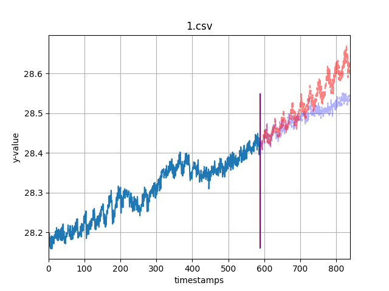
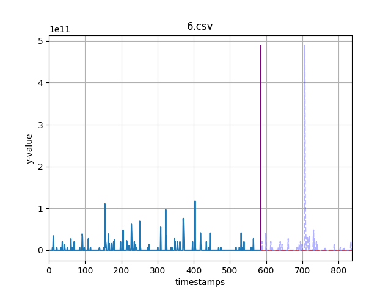
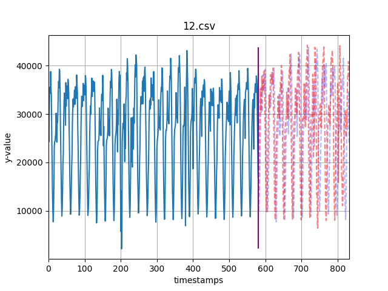
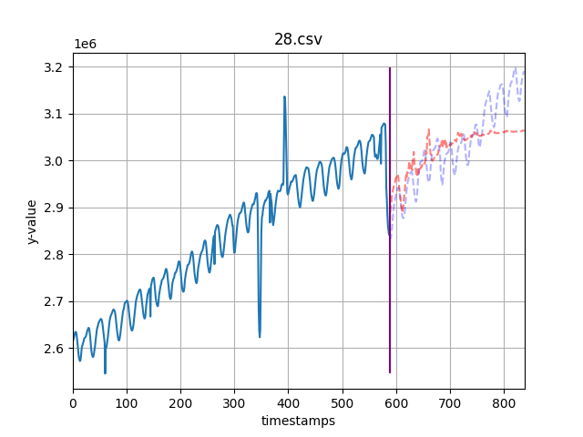

# NBeats with RevIN implementation
To implement NBeats with RevIN normalization layer for univariate Time Series datasets.

This repo provides an implementation of the N-Beats model with RevIN normalization.\
N-Beats - [[Paper](https://arxiv.org/abs/1905.10437)] [[GitHub](https://github.com/ElementAI/N-BEATS)]\
RevIN - [[Paper](https://openreview.net/pdf?id=cGDAkQo1C0p)] [[GitHub](https://github.com/ts-kim/RevIN)]

 \
 

_Note: This repo uses a variant of N-Beats implementation as provided in this [link](https://github.com/philipperemy/n-beats)._

## Environment
This code was tested in python 3.9.

## Quick Start
1. Install PyTorch == v.1.12.0 (tested) following the [official instruction](https://pytorch.org/)
2. Install the required libraries from requirements.txt.
```bash
pip install -r requirements.txt
```
3. Download the file "RevIN.py" from [RevIN](https://github.com/ts-kim/RevIN) and place in model/ folder.
4. Run the following command to train and infer NBeatsRevin model on all files in "data_path" folder.
```bash
python run.py -data_path dataset -out_path output -batch_size 512
```
### Command-line arguments
- data_path - path to the dataset folder (default: dataset)
- out_path - path to the outputs folder to save output plots, and test score csv (default: output)
- save_path - path to save the trained pytorch model for each dataset (default: save)
- save - flag to enable saving trained pytorch models (default: false)
- batch_size - set the batch size of training dataset (default: 256)
- n_epochs - number of epochs to train the model upon (default: 1500)
- random_seed - seed to set for pytorch for reproducibility (default: 42)


## Repository Structure

### Model
PyTorch implementation of N-Beats with RevIN normalization can be found in `model/NBeatsRevin.py`

### Datasets
A few sample univariate time series datasets can be found in `dataset/*.csv`. (I am not able to provide data of sample plots above due to ownership issues, but you can find plenty of datasets online)

### Experiment
`run.py` consists of the requisite code to train and infer the time series datasets. The python script trains the model on all files in the data_path argument, saves prediction plots and test scores in out_path argument. Optionally, the trained pytorch model can be saved using save_path command line argument.

